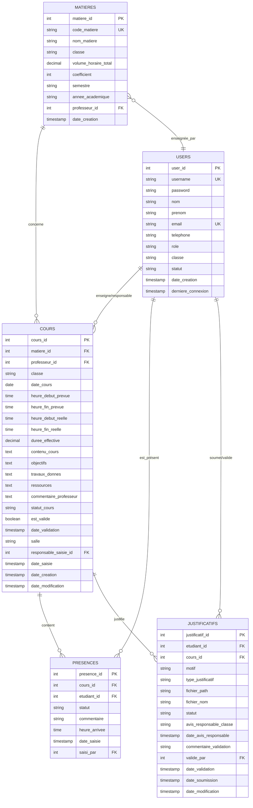

# Cahier de Texte Numérique - TDSI

## 📋 Description du Projet

Système de numérisation des cahiers de texte pour l'Institut TDSI (Université Cheikh Anta Diop de Dakar). Cette application web J2EE permet la gestion complète des cours, présences, justificatifs d'absence et rapports académiques.

---

## 🏗️ Architecture

### Stack Technique
- **Backend**: Java 11, Servlets J2EE
- **Serveur d'application**: Apache Tomcat 9.0
- **Base de données**: MySQL (via phpMyAdmin)
- **Frontend**: JSP, HTML, CSS
- **Architecture**: MVC (Model-View-Controller)

### Structure du Projet
```
CahierDeTEXTE/
├── src/main/java/com/cahiertexte/
│   ├── controller/       # Servlets (contrôleurs)
│   ├── dao/             # Data Access Objects
│   ├── model/           # Entités métier
│   ├── service/         # Logique métier
│   └── util/            # Utilitaires (hashage, etc.)
├── src/main/webapp/
│   └── views/           # Pages JSP
└── build/               # Classes compilées
```

---

## 👥 Acteurs et Rôles

### 1. **Responsable de Formation**
- Gestion complète des utilisateurs (CRUD)
- Gestion des matières (création, modification, suppression)
- Validation des justificatifs d'absence
- Consultation de tous les cours et statistiques
- Alertes sur les matières (< 12h restantes)

### 2. **Responsable de Classe**
- Planification des cours pour sa classe
- Saisie du cahier de texte
- Gestion des présences/absences
- Visualisation des statistiques de sa classe
- Identification des étudiants en absence critique (≥3 absences)

### 3. **Professeur**
- Consultation de ses cours
- Saisie du cahier de texte pour ses cours
- Validation finale des cours réalisés
- Gestion des présences
- Statistiques de ses matières

### 4. **Étudiant**
- Consultation de l'emploi du temps
- Visualisation de ses absences
- Soumission de justificatifs d'absence
- Consultation de ses statistiques de présence

---

## 🗄️ Modèle Conceptuel de Données (MCD)



---

## 🔑 Énumérations

### Rôles Utilisateurs
- `RESPONSABLE_FORMATION`
- `RESPONSABLE_CLASSE`
- `PROFESSEUR`
- `ETUDIANT`

### Classes
- `CI_M1` (Cybersécurité et Infrastructure - Master 1)
- `CI_M2` (Cybersécurité et Infrastructure - Master 2)
- `MCS_M1` (Management de la Cybersécurité - Master 1)
- `MCS_M2` (Management de la Cybersécurité - Master 2)

### Statuts de Cours
- `PLANIFIE` : Cours programmé mais non réalisé
- `REALISE` : Cours effectué, cahier de texte saisi
- `ANNULE` : Cours annulé
- `RATTRAPAGE` : Cours de rattrapage

### Statuts de Présence
- `PRESENT` : Étudiant présent
- `ABSENT` : Étudiant absent
- `RETARD_ACCEPTE` : Retard justifié accepté
- `RETARD_REFUSE` : Retard non justifié

### Statuts de Justificatif
- `EN_ATTENTE` : Soumis, en attente d'examen
- `VU_RESPONSABLE_CLASSE` : Vu par le responsable de classe
- `ACCEPTE` : Validé par le responsable de formation
- `REFUSE` : Rejeté par le responsable de formation

### Types de Justificatifs
- `MEDICAL` : Certificat médical
- `ADMINISTRATIF` : Justificatif administratif
- `FAMILIAL` : Motif familial
- `AUTRE` : Autre motif

---

## 🚀 Fonctionnalités Principales

### 1. Gestion des Cours
- ✅ Planification de cours par le responsable de classe
- ✅ Saisie du cahier de texte (contenu, objectifs, travaux, ressources)
- ✅ Validation par le professeur
- ✅ Calcul automatique de la durée effective
- ✅ Suivi du volume horaire (réalisé/restant)

### 2. Gestion des Présences
- ✅ Initialisation automatique des présences (tous présents par défaut)
- ✅ Saisie des absences et retards
- ✅ Calcul du taux de présence par étudiant
- ✅ Identification des étudiants critiques (≥3 absences)
- ✅ Top 5 des absences par classe

### 3. Gestion des Justificatifs
- ✅ Soumission par les étudiants
- ✅ Workflow de validation (Responsable Classe → Responsable Formation)
- ✅ Upload de fichiers justificatifs
- ✅ Avis et commentaires
- ✅ Historique complet

### 4. Tableaux de Bord
- ✅ Dashboard adapté à chaque rôle
- ✅ Statistiques en temps réel
- ✅ Alertes (cours non validés, matières < 12h)
- ✅ Graphiques et indicateurs

### 5. Rapports et Statistiques
- ✅ Rapports par classe
- ✅ Statistiques de présence globales
- ✅ Suivi des matières (progression)
- ✅ Export de données (à implémenter)

---

## 🔒 Sécurité

### Authentification
- Hashage des mots de passe avec **SHA-256**
- Sessions HTTP sécurisées (durée : 2h)
- Vérification des rôles sur chaque requête

### Contrôle d'Accès
- Redirection automatique selon le rôle
- Vérification des permissions (exemple : un professeur ne peut valider que ses cours)
- Protection contre les accès non autorisés

---

## 📦 Installation et Déploiement

### Prérequis
- Java JDK 11+
- Apache Tomcat 9.0
- MySQL Server
- Eclipse IDE ou IntelliJ IDEA (avec plugin J2EE)

### Configuration de la Base de Données

1. **Créer la base de données** :
```sql
CREATE DATABASE Cahier_de_Texte CHARACTER SET utf8mb4 COLLATE utf8mb4_unicode_ci;
```

2. **Configurer la connexion** dans `DatabaseConnection.java` :
```java
private static final String HOST = "localhost";
private static final int PORT = 3306;
private static final String DATABASE = "Cahier_de_Texte";
private static final String USERNAME = "root";
private static final String PASSWORD = "";
```

3. **Exécuter le script SQL** (voir section Scripts SQL ci-dessous)

### Déploiement sur Tomcat

1. **Dans Eclipse** :
   - Clic droit sur le projet → Run As → Run on Server
   - Sélectionner Tomcat 9.0

2. **Déploiement manuel** :
   - Générer le WAR : `mvn package`
   - Copier le WAR dans `TOMCAT_HOME/webapps/`
   - Démarrer Tomcat

3. **Accéder à l'application** :
   - URL : `http://localhost:8080/CahierDeTEXTE`
   - Page de test : `http://localhost:8080/CahierDeTEXTE/test`

---

## 📊 Scripts SQL de Création

### Création de la Table Users
```sql
CREATE TABLE users (
    user_id INT PRIMARY KEY AUTO_INCREMENT,
    username VARCHAR(50) UNIQUE NOT NULL,
    password VARCHAR(255) NOT NULL,
    nom VARCHAR(100) NOT NULL,
    prenom VARCHAR(100) NOT NULL,
    email VARCHAR(150) UNIQUE NOT NULL,
    telephone VARCHAR(20),
    role ENUM('RESPONSABLE_FORMATION', 'RESPONSABLE_CLASSE', 'PROFESSEUR', 'ETUDIANT') NOT NULL,
    classe ENUM('CI_M1', 'CI_M2', 'MCS_M1', 'MCS_M2'),
    statut ENUM('ACTIF', 'INACTIF', 'SUSPENDU') DEFAULT 'ACTIF',
    date_creation TIMESTAMP DEFAULT CURRENT_TIMESTAMP,
    derniere_connexion TIMESTAMP NULL
);
```

### Création de la Table Matieres
```sql
CREATE TABLE matieres (
    matiere_id INT PRIMARY KEY AUTO_INCREMENT,
    code_matiere VARCHAR(20) UNIQUE NOT NULL,
    nom_matiere VARCHAR(200) NOT NULL,
    classe ENUM('CI_M1', 'CI_M2', 'MCS_M1', 'MCS_M2') NOT NULL,
    volume_horaire_total DECIMAL(5,2) NOT NULL,
    coefficient INT DEFAULT 1,
    semestre ENUM('SEMESTRE_1', 'SEMESTRE_2') NOT NULL,
    annee_academique VARCHAR(20) NOT NULL,
    professeur_id INT,
    date_creation TIMESTAMP DEFAULT CURRENT_TIMESTAMP,
    FOREIGN KEY (professeur_id) REFERENCES users(user_id) ON DELETE SET NULL
);
```

### Création de la Table Cours
```sql
CREATE TABLE cours (
    cours_id INT PRIMARY KEY AUTO_INCREMENT,
    matiere_id INT NOT NULL,
    professeur_id INT NOT NULL,
    classe ENUM('CI_M1', 'CI_M2', 'MCS_M1', 'MCS_M2') NOT NULL,
    date_cours DATE NOT NULL,
    heure_debut_prevue TIME NOT NULL,
    heure_fin_prevue TIME NOT NULL,
    heure_debut_reelle TIME,
    heure_fin_reelle TIME,
    duree_effective DECIMAL(4,2),
    contenu_cours TEXT,
    objectifs TEXT,
    travaux_donnes TEXT,
    ressources TEXT,
    commentaire_professeur TEXT,
    statut_cours ENUM('PLANIFIE', 'REALISE', 'ANNULE', 'RATTRAPAGE') DEFAULT 'PLANIFIE',
    est_valide BOOLEAN DEFAULT FALSE,
    date_validation TIMESTAMP NULL,
    salle VARCHAR(50),
    responsable_saisie_id INT,
    date_saisie TIMESTAMP NULL,
    date_creation TIMESTAMP DEFAULT CURRENT_TIMESTAMP,
    date_modification TIMESTAMP DEFAULT CURRENT_TIMESTAMP ON UPDATE CURRENT_TIMESTAMP,
    FOREIGN KEY (matiere_id) REFERENCES matieres(matiere_id) ON DELETE CASCADE,
    FOREIGN KEY (professeur_id) REFERENCES users(user_id) ON DELETE CASCADE,
    FOREIGN KEY (responsable_saisie_id) REFERENCES users(user_id) ON DELETE SET NULL
);
```

### Création de la Table Presences
```sql
CREATE TABLE presences (
    presence_id INT PRIMARY KEY AUTO_INCREMENT,
    cours_id INT NOT NULL,
    etudiant_id INT NOT NULL,
    statut ENUM('PRESENT', 'ABSENT', 'RETARD_ACCEPTE', 'RETARD_REFUSE') DEFAULT 'PRESENT',
    commentaire TEXT,
    heure_arrivee TIME,
    date_saisie TIMESTAMP DEFAULT CURRENT_TIMESTAMP,
    saisi_par INT,
    FOREIGN KEY (cours_id) REFERENCES cours(cours_id) ON DELETE CASCADE,
    FOREIGN KEY (etudiant_id) REFERENCES users(user_id) ON DELETE CASCADE,
    FOREIGN KEY (saisi_par) REFERENCES users(user_id) ON DELETE SET NULL
);
```

### Création de la Table Justificatifs
```sql
CREATE TABLE justificatifs (
    justificatif_id INT PRIMARY KEY AUTO_INCREMENT,
    etudiant_id INT NOT NULL,
    cours_id INT NOT NULL,
    motif TEXT NOT NULL,
    type_justificatif ENUM('MEDICAL', 'ADMINISTRATIF', 'FAMILIAL', 'AUTRE') NOT NULL,
    fichier_path VARCHAR(500),
    fichier_nom VARCHAR(255),
    statut ENUM('EN_ATTENTE', 'VU_RESPONSABLE_CLASSE', 'ACCEPTE', 'REFUSE') DEFAULT 'EN_ATTENTE',
    avis_responsable_classe TEXT,
    date_avis_responsable TIMESTAMP NULL,
    commentaire_validation TEXT,
    valide_par INT,
    date_validation TIMESTAMP NULL,
    date_soumission TIMESTAMP DEFAULT CURRENT_TIMESTAMP,
    date_modification TIMESTAMP DEFAULT CURRENT_TIMESTAMP ON UPDATE CURRENT_TIMESTAMP,
    FOREIGN KEY (etudiant_id) REFERENCES users(user_id) ON DELETE CASCADE,
    FOREIGN KEY (cours_id) REFERENCES cours(cours_id) ON DELETE CASCADE,
    FOREIGN KEY (valide_par) REFERENCES users(user_id) ON DELETE SET NULL
);
```

---

## 🧪 Données de Test

### Mot de passe par défaut
**Password en clair** : `password123`  
**Hash SHA-256** : `ef92b778bafe771e89245b89ecbc08a44a4e166c06659911881f383d4473e94f`

### Utilisateurs de Test
```sql
-- Responsable de Formation
INSERT INTO users (username, password, nom, prenom, email, role) 
VALUES ('admin.formation', 'ef92b778bafe771e89245b89ecbc08a44a4e166c06659911881f383d4473e94f', 
        'Diop', 'Amadou', 'admin@tdsi.sn', 'RESPONSABLE_FORMATION');

-- Responsable de Classe CI_M1
INSERT INTO users (username, password, nom, prenom, email, role, classe) 
VALUES ('resp.ci.m1', 'ef92b778bafe771e89245b89ecbc08a44a4e166c06659911881f383d4473e94f', 
        'Ndiaye', 'Fatou', 'resp.cim1@tdsi.sn', 'RESPONSABLE_CLASSE', 'CI_M1');

-- Professeur
INSERT INTO users (username, password, nom, prenom, email, role) 
VALUES ('prof.samb', 'ef92b778bafe771e89245b89ecbc08a44a4e166c06659911881f383d4473e94f', 
        'Samb', 'Moussa', 'prof.samb@tdsi.sn', 'PROFESSEUR');

-- Étudiant
INSERT INTO users (username, password, nom, prenom, email, role, classe) 
VALUES ('etud.fall', 'ef92b778bafe771e89245b89ecbc08a44a4e166c06659911881f383d4473e94f', 
        'Fall', 'Aissatou', 'fall@etudiant.tdsi.sn', 'ETUDIANT', 'CI_M1');
```

---

## 🔧 Points d'Extension

### À Développer
- [ ] Export PDF des rapports
- [ ] Notifications par email
- [ ] API REST pour mobile
- [ ] Upload réel de fichiers justificatifs
- [ ] Génération automatique d'emplois du temps
- [ ] Module de notes/évaluations
- [ ] Historique des modifications

---

## 📞 Contact

**Projet TDSI - Université Cheikh Anta Diop de Dakar**  
Année Académique : 2024-2025

---

## 📝 Licence

Projet académique - Institut TDSI

---

## 🎯 Workflow Typique

### Scénario 1 : Planification d'un Cours
1. **Responsable de classe** se connecte
2. Accède à son dashboard
3. Clique sur "Planifier un cours"
4. Remplit le formulaire (matière, date, heure, salle, professeur)
5. Le cours est créé avec statut `PLANIFIE`

### Scénario 2 : Saisie du Cahier de Texte
1. **Responsable de classe** ou **Professeur** accède au cours
2. Clique sur "Saisir le cahier de texte"
3. Remplit : contenu, objectifs, travaux, ressources
4. Le cours passe en statut `REALISE`
5. Le professeur doit ensuite **valider** le cours

### Scénario 3 : Gestion d'une Absence
1. **Étudiant** consulte ses absences
2. Clique sur "Justifier cette absence"
3. Soumet un justificatif (type + motif)
4. **Responsable de formation** consulte les justificatifs en attente
5. Accepte ou refuse avec commentaire
